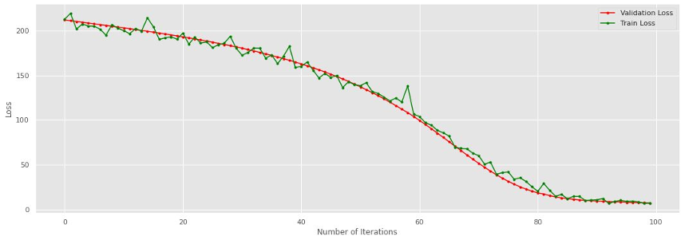
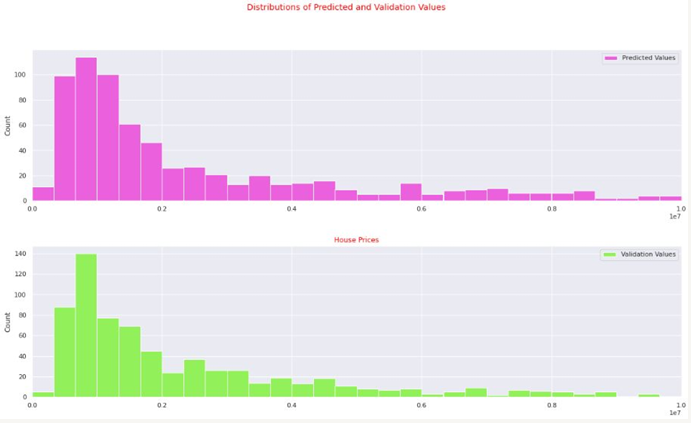

# 🏠 Linear Regression Model for House Price Prediction

**Machine Learning Course Project**

---

## 📌 Table of Contents

- [Introduction](#introduction)
- [About Linear Regression](#about-linear-regression)
- [Dataset from Emlakjet](#dataset-from-emlakjet)
- [Data Preprocessing](#data-preprocessing)
- [Currency Data Integration](#currency-data-integration)
- [Model Implementation](#model-implementation)
- [Results](#results)
- [Challenges & Solutions](#challenges--solutions)
- [Future Recommendations](#future-recommendations)

---

## 🧠 Introduction

The goal was to build a machine learning model that could accurately predict house prices based on a dataset obtained from Emlakjet, enriched with Dollar-to-TRY exchange rates.

## 📈 About Linear Regression

Linear regression is a supervised learning algorithm that predicts numerical values. It models the relationship between dependent and independent variables using a line equation.

## 🏘️ Dataset from Emlakjet

- Source: [Emlakjet](https://www.emlakjet.com) — Istanbul real estate data.
- Features include: location, house age, square meter (M²), update date, and more.
- A new column for USD/TRY was added, based on the update date.

## 🧹 Data Preprocessing

- Removed or imputed missing values.
- Created TRY price column by linking house prices to historical exchange rates.
- Filtered out outlier values in the price column.

## 💱 Currency Data Integration

- Historical USD to TRY data was matched to ad update dates.
- Formatting differences (e.g., Turkish month names) were normalized.

## 🤖 Model Implementation

**Steps:**
1. Split dataset into train/test.
2. Train linear regression model.
3. Evaluate with test data.
4. Integrate Dollar/TRY into the prediction model.

  
*Model loss decreases over epochs.*

  
*Predicted vs actual values comparison.*

## ⚠️ Challenges & Solutions

| Challenge | Solution |
|----------|----------|
| Different date formats | Normalized Turkish date formats |
| Outlier values | Removed from `PRICE` column |
| Merging currency data | Reformatted and filtered both datasets |

## 🔮 Future Recommendations

- Experiment with other regression models (e.g., Ridge, Lasso).
- Integrate more features (e.g., neighborhood crime rates, school zones).
- Use cross-validation for model evaluation.

---

> _This project was developed as part of a Machine Learning course._